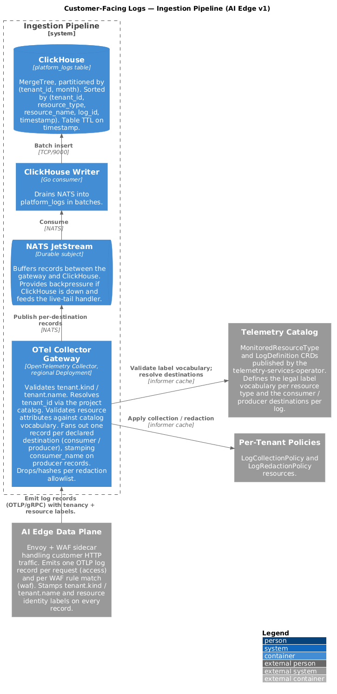

# Customer-Facing Logs

Status: Draft
Scope (v1): AI Edge (HTTPProxy + WAF) logs only

## Motivation

Datum platform services emit operational signals — request logs, security
events, control-plane activity — that customers need visibility into for
debugging, compliance, and security investigation. Today there is no
customer-facing query surface for these logs. Customers running workloads on
AI Edge (Datum's HTTP proxy + WAF product) cannot answer basic questions
like "show me 5xx responses for my proxy in the last hour" or "which
requests did the WAF block."

This design defines a project-scoped, multi-tenant logs pipeline with a
Loki-compatible query API. AI Edge is the v1 scope: it produces high-volume
access logs and WAF events that are the most acute customer need, and its
log shape exercises every layer of the design without depending on
control-plane audit-log work that lives elsewhere.

## Goals (v1)

- Customers can query AI Edge access logs and WAF events for their project
  through Grafana, LogCLI, and any Loki-compatible client.
- All logs are tenant-isolated at storage and query time; cross-tenant
  reads are structurally impossible.
- Log schemas are declared once by the producing service and surface
  automatically as catalog metadata (resource types, label vocabulary, log
  definitions).
- Service teams can see logs from their own service across all consumers
  in the service's producer project; customers only see logs scoped to
  their own project. This follows GCP's consumer / producer pattern, which
  falls out naturally from Milo's project hierarchy (both tenants and
  service producers are modelled as projects).
- 7-day default retention for operational logs. Retention is platform-set
  in v1; not user-controllable.

## Non-Goals (v1)

- Control-plane audit logs. Audit logs are collected by the activity
  system (`milo-os/activity`) and stored separately; they do not flow
  through this pipeline.
- Customer-configurable log export (`LogSource` in `ExportPolicy`) —
  deferred to a follow-on enhancement.
- Body-content redaction via regex; v1 redacts at attribute level only.
- Log-based metrics and alerting derived from log streams.
- Per-project ingestion quota. Volume protection in v1 is platform-set
  defaults at the gateway; a `LogIngestionQuota` resource is a follow-on
  enhancement.

## Layers

### 1. Service Declaration

Services declare what they emit in their `ServiceConfiguration`
(`services.miloapis.com/v1alpha1`). Two fields participate:

- `spec.monitoredResourceTypes[]` — already fans out to
  `billing.MonitoredResourceType`; now also fans out to a new
  `telemetry.MonitoredResourceType`.
- `spec.logs[]` (new) — fans out to `telemetry.LogDefinition`.

AI Edge declaration:

```yaml
apiVersion: services.miloapis.com/v1alpha1
kind: ServiceConfiguration
metadata:
  name: networking-datumapis-com
spec:
  serviceRef:
    name: networking-datumapis-com
  phase: Published
  monitoredResourceTypes:
    - resourceTypeName: networking.datumapis.com/HTTPProxy
      displayName: HTTP Proxy
      gvk:
        group: networking.datumapis.com
        kind: HTTPProxy
      labels:
        - name: resource.group
          description: API group of the resource (networking.datumapis.com).
        - name: resource.kind
          description: Resource kind (HTTPProxy).
        - name: resource.name
          description: Name of the HTTPProxy instance.
        - name: resource.namespace
          description: Project namespace the HTTPProxy belongs to.
        - name: hostname
          description: Hostname the request was received on.
  logs:
    - logID: networking.datumapis.com/httpproxy-access
      displayName: HTTP Proxy Access Log
      description: One entry per HTTP request handled by the proxy.
      monitoredResourceType: networking.datumapis.com/HTTPProxy
      entrySchema:
        - name: http.request.id
          description: Per-request correlation ID (Envoy x-request-id).
        - name: http.request.method
          description: HTTP method (GET, POST, etc).
        - name: http.response.status_code
          description: HTTP response status returned to the client.
        - name: url.path
          description: Request path.
        - name: client.address
          description: Client IP.
        - name: user_agent.original
          description: Verbatim User-Agent header sent by the client.
        - name: http.request.duration_ms
          description: Request duration in milliseconds.
        - name: edge.pop.ingress
          description: PoP code that received the request (e.g. cdg1).
        - name: edge.pop.upstream
          description: PoP that routed to the upstream when different from ingress; empty when handled at ingress.
        - name: waf.outcome
          description: Summary of WAF decision for this request — allowed, blocked, or challenged.
        - name: waf.matched_rules
          description: Number of WAF rules that matched on this request. Non-zero implies a paired httpproxy-waf entry exists per matched rule.
      destinations:
        - type: consumer  # written to the customer's project
        - type: producer  # written to the networking service's producer project
      categoryGroups: [allLogs]

    - logID: networking.datumapis.com/httpproxy-waf
      displayName: HTTP Proxy WAF Event Log
      description: One entry per WAF rule evaluation that matched or blocked.
      monitoredResourceType: networking.datumapis.com/HTTPProxy
      entrySchema:
        - name: http.request.id
          description: Matches the http.request.id on the paired httpproxy-access entry. PoP, user agent, response status, and other request-level context are joined from there.
        - name: waf.rule.id
          description: Identifier of the WAF rule that matched.
        - name: waf.action
          description: Action taken for this rule — block, log, challenge.
        - name: waf.severity
          description: Severity classification of the matched rule.
      destinations:
        - type: consumer
        - type: producer
      categoryGroups: [allLogs]
```

A log entry is written once per declared destination:

- `consumer` — the customer's project. They query their own project and
  see only their data.
- `producer` — the service's producer project (here, the networking
  service's project). The Datum networking team queries that project and
  sees logs across all consumers, with the originating consumer preserved
  on each entry as a `consumer_name` label.

Producer-only log types (no `consumer` destination) are also supported —
useful for internal diagnostics that should never be visible to
customers.

### 2. Platform Catalog

The services operator (`milo-os/telemetry`) owns two new CRDs that the
`ServiceConfiguration` controller fans out into.

`telemetry.MonitoredResourceType` — instance-identifying label vocabulary
for a resource Kind. Parallel to `billing.MonitoredResourceType`:

```yaml
apiVersion: telemetry.miloapis.com/v1alpha1
kind: MonitoredResourceType
metadata:
  name: networking-datumapis-com-httpproxy
spec:
  resourceTypeName: networking.datumapis.com/HTTPProxy
  phase: Published
  displayName: HTTP Proxy
  gvk:
    group: networking.datumapis.com
    kind: HTTPProxy
  labels:
    - name: resource.group
    - name: resource.kind
    - name: resource.name
    - name: resource.namespace
    - name: hostname
```

`LogDefinition` — the log type catalog entry; references
`MonitoredResourceType` by `resourceTypeName`:

```yaml
apiVersion: telemetry.miloapis.com/v1alpha1
kind: LogDefinition
metadata:
  name: networking-datumapis-com-httpproxy-access
spec:
  logID: networking.datumapis.com/httpproxy-access
  phase: Published
  displayName: HTTP Proxy Access Log
  monitoredResourceType: networking.datumapis.com/HTTPProxy
  entrySchema:
    - name: http.request.id
    - name: http.request.method
    - name: http.response.status_code
    - name: url.path
    - name: client.address
    - name: user_agent.original
    - name: http.request.duration_ms
    - name: edge.pop.ingress
    - name: edge.pop.upstream
    - name: waf.outcome
    - name: waf.matched_rules
  destinations:
    - type: consumer
    - type: producer
  categoryGroups: [allLogs]
```

Both CRDs are server-managed: the `ServiceConfiguration` controller is the
sole writer. Customers read them via standard list/get to populate UIs and
discover available log types.

### 3. Ingestion Pipeline



AI Edge data-plane components (Envoy + WAF sidecar) emit logs over OTLP to
a regional OTel Collector gateway. Workload identity cannot be relied on
to resolve the project — the source of these logs is typically a service
component (e.g. Envoy) writing to a log sink, not a consumer-authored
application running with the consumer's identity. Tenancy therefore has
to travel on the log record itself.

Every log record entering the gateway must carry tenancy labels stamped
by the producing service:

- `tenant.kind` — the type of tenant that generated the log
  (`Project`, `Organization`, `User`).
- `tenant.name` — the resource name of the tenant
  (e.g. `personal-project-xyz`).

Records missing these labels are rejected. Services are also responsible
for stamping resource identity labels declared by their
`MonitoredResourceType` (`resource.group`, `resource.kind`,
`resource.name`, `resource.namespace`, and any service-specific labels
such as `hostname`). The gateway enforces the vocabulary; it does not
inject tenancy or instance identity.

Gateway responsibilities:

1. Receive OTLP log records.
2. Validate that `tenant.kind` and `tenant.name` are present and refer to
   a tenant the caller is authorised to write logs for.
3. Look up the declared `MonitoredResourceType` for the entry's
   `resource_type` and validate that emitted resource attributes are a
   subset of the declared label vocabulary. Reject undeclared labels.
4. Resolve `tenant_id` from `(tenant.kind, tenant.name)` via the project
   catalog.
5. For each declared destination on the matching `LogDefinition`, emit one
   log record:
   - `consumer` → `tenant_id` resolved from the originating tenant.
   - `producer` → `tenant_id` resolved from the service's producer
     project, with `consumer_name` set to the originating tenant.
6. Hand the resulting records off to NATS for durable buffering.

A NATS JetStream subject sits between the gateway and ClickHouse. NATS
gives us:

- **Backpressure**. If ClickHouse is down or slow, the consumer pauses;
  NATS retains the backlog rather than the gateway dropping records.
- **Live tail**. The same stream feeds the Loki `/tail` handler, so tail
  doesn't need to poll ClickHouse — see Live Tail below.

A ClickHouse-writer consumer drains NATS into the `platform_logs` table
in batches.

### 4. Storage

Shared ClickHouse `platform_logs` table, OTel-aligned schema, `tenant_id`
first in `ORDER BY` and partition key:

```sql
CREATE TABLE platform_logs (
    tenant_id           UInt32,
    timestamp           UInt64,
    observed_timestamp  UInt64,
    severity_number     UInt8,
    severity_text       LowCardinality(String),
    body                String,
    log_id              LowCardinality(String),
    resource_type       LowCardinality(String),
    resource_group      LowCardinality(String),
    resource_kind       LowCardinality(String),
    resource_name       String,
    resource_namespace  LowCardinality(String),
    consumer_name       String,        -- empty on consumer-destination rows
    attributes_string   Map(String, String),
    resources_string    Map(String, String),
    trace_id            String,
    span_id             String
)
ENGINE = MergeTree()
PARTITION BY (tenant_id, toYYYYMM(toDateTime(timestamp / 1e9)))
ORDER BY (tenant_id, resource_type, resource_name, log_id, timestamp)
TTL toDateTime(timestamp / 1e9) + INTERVAL 7 DAY DELETE;
```

Top-level columns are chosen for the two common query shapes:

- **Per-resource**: "give me all access logs for proxy XYZ". Served by
  the `(tenant_id, resource_type, resource_name, log_id)` prefix of the
  sort key.
- **Per-tenant**: "give me all logs for project X". Served by the
  `tenant_id` prefix.

`log_id`, `resource_type`, `resource_group`, `resource_kind`, and
`resource_namespace` are all low-cardinality and appear in nearly every
query's filter clause. `resource_name` is high-cardinality but is the
primary drill-down key, so it earns a top-level column and a position in
the sort key. `consumer_name` is populated only on producer-destination
rows, so service teams can filter "show me logs for consumer X" without
cross-tenant grants.

### 5. Query API — Loki-Compatible, Project-Scoped

Customer query surface is a Loki-compatible HTTP API exposed under the
project's control-plane endpoint:

```
GET  {project-control-plane-endpoint}/telemetry/loki/api/v1/query
GET  {project-control-plane-endpoint}/telemetry/loki/api/v1/query_range
GET  {project-control-plane-endpoint}/telemetry/loki/api/v1/labels
GET  {project-control-plane-endpoint}/telemetry/loki/api/v1/label/{name}/values
GET  {project-control-plane-endpoint}/telemetry/loki/api/v1/series
GET  {project-control-plane-endpoint}/telemetry/loki/api/v1/tail
```

`{project-control-plane-endpoint}` is the same per-project control-plane
URL Milo already issues for Kubernetes API access; the telemetry handler
mounts at `/telemetry/...` under it. The project is therefore resolved
from the endpoint itself — no `{project}` placeholder in the path, no
`X-Scope-OrgID` header. `X-Scope-OrgID` sent by Grafana is ignored.

The Milo gateway resolves the endpoint to a `tenant_id` and enforces IAM
before the request reaches the Loki handler. The handler itself is a pure
query layer:

- Parses LogQL.
- Translates to ClickHouse SQL: stream selectors → top-level column
  lookups (`tenant_id`, `resource_type`, `resource_name`, `log_id`, …)
  where possible, `resources_string` map lookups otherwise; line filters
  → `body LIKE` / full-text; parsed field filters → `attributes_string`
  lookups.
- Executes with `tenant_id` already injected from the endpoint context.
- Serialises results in Loki's response format.

Label and series discovery is served from the `MonitoredResourceType`
catalog rather than from ClickHouse, so discovery works on empty projects
and Grafana's stream-selector UI populates correctly on first open.

Grafana datasource configuration: base URL set to the project's
control-plane endpoint with `/telemetry/` appended, type Loki, no custom
plugin.

#### Example queries

Consumer querying their own project:

```logql
{log_id="networking.datumapis.com/httpproxy-access", resource_name="api-gateway"}
  | json | http_response_status_code >= 500
```

Service team querying the networking service's producer project — across
all consumers, or drilling into one:

```logql
# Aggregate error rate by consumer
sum by (consumer_name) (
  rate({log_id="networking.datumapis.com/httpproxy-access"}
    | json | http_response_status_code >= 500 [5m])
)

# Drill into a specific consumer
{log_id="networking.datumapis.com/httpproxy-access", consumer_name="ecommerce-co"}
  | json | http_response_status_code >= 500
```

No cross-tenant grants are needed for either side — each principal has
IAM on the project (consumer or producer) whose endpoint they're querying.

A secondary `LogQuery` virtual resource (Kubernetes-native, modelled on
`AuditLogQuery` in `milo-os/activity`) is retained for kubectl-native and
GitOps workflows. It shares the same LogQL → SQL translation layer.

### 6. Access Control

Milo IAM gates access at the project boundary via standard Kubernetes
RBAC on the project's telemetry endpoint. Because the URL is the project
control-plane endpoint, the same RBAC that protects the rest of the
project's resources protects log queries — no separate access model.

Consumer vs. producer separation is what gives service teams visibility
across all consumers of their service: a Datum networking SRE needs IAM
only on the networking service's producer project to see access logs for
every customer's `HTTPProxy`. No cross-tenant grant is required.

## Cross-Cutting Concerns

### Retention

Fixed defaults; not user-controllable in v1.

| Category Group | Retention |
|---|---|
| `allLogs`      | 7 days |

Implemented via the table TTL on the `timestamp` column. Per-project or
per-category retention overrides are a follow-on enhancement.

### Default Enablement

`allLogs` collection is opt-in per project via a `LogCollectionPolicy`
resource. Customers don't get surprise bills from log volume tracking
workload activity they didn't request.

For v1 (AI Edge only): proxy access logs default off, WAF events default
on (the volume is bounded by request rate × match rate, not full request
rate).

### Live Tail

The Loki `/tail` endpoint is served by a small handler that subscribes to
the NATS subject the ingestion pipeline already writes to, filters by
`tenant_id` and the stream selector from the request, and streams
matching records over the WebSocket. This avoids polling ClickHouse and
keeps tail latency in the low hundreds of milliseconds.

### Request Correlation

A single HTTP request through AI Edge produces one access log entry
(`httpproxy-access`) and zero-or-more WAF entries (`httpproxy-waf`, one
per matched rule). All of them carry the same `http.request.id`
(Envoy's `x-request-id`, which already propagates through the filter
chain to the WAF sidecar). That's the join key.

The model favours denormalisation on the access log for the common case:

- `waf.outcome` (`allowed` / `blocked` / `challenged`) and
  `waf.matched_rules` (count) are stamped directly on the access log,
  so the high-frequency "show me blocked requests" query is a single
  stream filter, not a join — same shape as GCP Cloud Armor's
  `enforcedSecurityPolicy.outcome` on LB access logs.
- The per-rule `httpproxy-waf` entries carry the rule id, action, and
  severity, joined back to the access log by `http.request.id` when the
  customer needs to drill in to "which rules fired on this request."

This supports a per-request lifecycle view (one row per request,
expandable to show every WAF rule that fired) without forcing every
query through a join. The lifecycle view itself is built by a single
`http.request.id` filter across both streams:

```logql
{log_id=~"networking.datumapis.com/httpproxy-(access|waf)"}
  | json | http_request_id="phl94-1779186433904-397d1bd984ce"
```

`edge.pop.ingress` (where the request was received) and
`edge.pop.upstream` (where it was routed to, when different) live only
on the access log; WAF entries inherit them by joining on
`http.request.id`. They're emission context, not resource identity —
one `HTTPProxy` serves from many PoPs — so they're stamped at emission
by the data plane and aren't part of the `MonitoredResourceType`
vocabulary. The same reasoning is why the WAF entry schema is lean:
client IP, user agent, response status, PoP — anything that already
exists on the paired access entry is reached via the join rather than
duplicated on every matched-rule row.

### Redaction

- Platform-managed allowlist of attribute keys always dropped or hashed
  at the gateway (`*.token`, `*.password`, `authorization`, ...).
- Customer-configurable `LogRedactionPolicy` resource — attribute-level
  drop/hash rules only.
- Body content is **not** redacted in v1. Documented as a constraint;
  services are pushed to put structured data in attributes.

## Fan-Out Summary

```
ServiceConfiguration
  spec.monitoredResourceTypes[]  →  billing.MonitoredResourceType   (existing)
                                 →  telemetry.MonitoredResourceType (new)
  spec.logs[]                    →  telemetry.LogDefinition          (new)
```

## v1 Delivery Slice

In dependency order:

1. CRDs: `MonitoredResourceType`, `LogDefinition`,
   `LogCollectionPolicy`, `LogRedactionPolicy`, `LogQuery`.
2. Fan-out controllers in this operator for `MonitoredResourceType` and
   `LogDefinition`.
3. NATS JetStream subject and ClickHouse `platform_logs` table.
4. OTel Collector gateway with tenancy-label validation
   (`tenant.kind` / `tenant.name`), label-vocabulary validation, and
   per-destination fan-out (`consumer` / `producer`) into NATS.
5. ClickHouse writer consumer draining NATS into `platform_logs`.
6. AI Edge data-plane integration: Envoy access log + WAF event OTLP
   exporters that stamp tenancy and resource identity labels;
   `ServiceConfiguration` for `networking-datumapis-com` with the two log
   definitions.
7. Loki API handler at
   `{project-control-plane-endpoint}/telemetry/loki/api/v1/...` backed by
   a LogQL → SQL translator, plus the NATS-backed `/tail` handler.
8. Catalog-backed labels/series discovery.
9. Grafana datasource documentation.

## Open Questions

- Whether `LogCollectionPolicy` is project-scoped or finer-grained (per
  `HTTPProxy`). Project-scoped is the simpler v1; finer granularity is a
  future enhancement once we see usage patterns.
- Loki LogQL feature subset for v1: instant queries, range queries,
  line filters, label filters are required; metric queries
  (`rate`, `sum by`, ...) likely deferred to v2.
- How the catalog-backed label discovery handles tenant-specific label
  values (e.g. the set of `resource.name` values that actually exist in
  the project). Likely a hybrid: label names from catalog, values from
  ClickHouse with a short cache.
